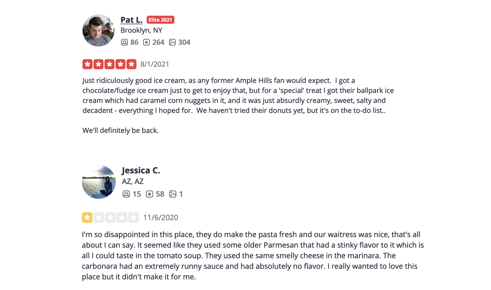

# CSCI S-89 Summer 2021

To: Professor Kurochkin and TAs  
From: Jordan Ziskin  
Due: August 6, 2021  
Re: Case Study in Social Media: Sentiment Analysis with Yelp Reviews

### Abstract:

AI has come a long way in the last few decades. One of the more recent developments has been in AI's understanding of how humans express emotion through language. It may be easy to teach a computer that the word “angry” indicates a negative emotion and “happy” indicates a positive emotion, but consider the sentence “David, while I understand you think you disappointed us all and ruined your chances at reaching nationals, I’m proud of you.” A sentence like this contains words that indicate negative emotions, like “disappointed” and “ruined”, as well as the word “proud”, indicating a positive emotion. We as humans can parse this sentence to figure out that the speaker feels positive emotions towards David, but for a computer, it might not be so obvious.\

One technique for teaching AI to identify positive and negative emotions expressed through language is sentiment analysis. Using neural networks, we can feed our AI hundreds of thousands of messages labeled as positive or negative and over time, the AI will be able to determine whether sentences it has never seen before are positive, negative, or neutral.\

Yelp reviews provide a great opportunity to perform sentiment analysis. Yelp is a review website in which users can rate local businesses on a scale from 1 to 5 stars with 5 stars being the best possible rating. Yelp averages more than 178 million unique visitors every month across its mobile, desktop, and app versions. Below is an example of two yelp reviews. They contain the users information, star rating, review date, and review text.\

  

Our goal is to create an AI that will view thousands upon thousands of yelp reviews classified as either positive or negative based on their star rating and use what it learned to be able to predict whether a review it has never seen before it a positive or a negative review.\

Yelp has been kind enough to provide a dataset containing over 8 million reviews available for download to the public at https://www.yelp.com/dataset. We will download this data and use the yelp_academic_dataset_review.json to extract our reviews and star ratings using the json package in python.\

This project has quite a few challenges. First, we have to think about how we define a positive or a negative review. While it is quite obvious that a 1 star and 2 star rating is negative and a 4 star and 5 star rating is positive, what do we do about 3 stars? We could consider 3 stars to be neutral, but in practice this is usually not the case. Having worked at Yelp for a summer and having talked to many users and business owners, I found 3 star reviews are rarely neutral, but rather contain both positive and negative aspects. In my experience, 3 stars is on the border of being great, but isn’t quite there and for that reason we will classify 3 stars as negative instead of positive or neutral.\

Our next challenge is one of file size and computer processing. The file that houses the yelp reviews is incredibly large at 10GB. Additionally, a word2vec file by google we will use for word embedding in some runs of the program is another 1.5GB uncompressed. This takes up a lot of space and memory and running this on my desktop was very slow. Of the 8 million reviews available from the yelp dataset, I was only able to run the program using just under 500,000 before the program crashed.\

To improve upon this implementation, I would consider using a cloud platform such as AWS to temporarily house the necessary large files and to run model training and fitting. Instead, I ran the entire project in a virtual pip environment from my 2019 MacBook Pro running MacOS Big Sur version 11.1 with a 2.3 GHz 8-Core Intel Core i9 processor and 32GB of memory.\

To train our model, I began with a long short-term memory (LSTM) neural network in Keras and built upon it in a variety of ways. Some trials involved word embedding using an outside word2vec resource while other trials involved a built in embedding layer into the Keras model. I also experimented with adding a 1D convolutional layer after the embedding layer. Dropout and recurrent dropout were used to prevent overfitting. In the end, I was able to create a handful of models that could predict the sentiment of yelp reviews with nearly 90% accuracy. Find a demonstration of the module at https://www.youtube.com/watch?v=ub_Gwzl3iXc\

\pagebreak

## Data Preprocessing
### Data Extraction
To process the data, I used the built-in json module in python to transform the json data to a python dictionary. I extracted the review text and numbers of stars from the json file and assigned them to python lists. Additionally, I changed 1, 2, and 3 stars to a 0 indicating a negative review and changed 4 and 5 star reviews to a 1 indicating a positive review. These transformed star ratings were assigned to a python list called sentiments. I also made sure to extract the same number of positive and negative reviews to keep my dataset balanced.

```
# processing.py

import os
import re
import json
import pickle
import numpy as np
from num2words import num2words
from keras.preprocessing.text import Tokenizer
from keras.preprocessing.sequence import pad_sequences
from gensim.models.keyedvectors import KeyedVectors

from .utilities import word_counts, save_to_file


def load_data(filepath, max_samples=None):
    """
    Takes a .json filepath with yelp reviews and appends the sentiment
    (1 meaning positive for 4-5 stars and 0 meaning negative for 1-3 stars)
    to the sentiment list and the text to the text list.

    Function will load same number of positive and negative reviews

    Return the text list and sentiments numpy array as a tuple
    """
    stars_to_sentiment = {1: 0, 2: 0, 3: 0, 4: 1, 5: 1}
    sentiments = []
    text = []

    # Open file and read lines
    with open(filepath) as f:
        lines = f.readlines()

        # If given max_samples, set a limit for each review type
        if max_samples is not None:
            limit = max_samples//2
            counts = {0: 0, 1: 0}

        # Loop through every sample
        for line in lines:
            data = json.loads(line)
            sentiment = stars_to_sentiment[data["stars"]]

            # Add sentiments and text
            if counts[sentiment] < limit:
                text.append(data['text'])
                sentiments.append(sentiment)
                counts[sentiment] += 1

            # Break out of loop if positive and negative reviews hit limit
            if counts[0] == limit and counts[1] == limit:
                break

        return text, sentiments
```

### Data Cleaning

Next, I began the process of cleaning the review text. This starts by turning all the text to lowercase, removing punctuation and special characters, and transforming numbers into words. It is also helpful to remove common words that provide no meaning to the text. This include words such as “the”, “a”, and “an”. In natural language processing, we call the list containing common words we want removed from our text a stop list. In this program, I give the user the option to either remove all the words appearing on a saved stop list or to create their own stop list from the review text.

```
# processing.py

def clean_text(text, stop_list=[], stop_only=False):
    """
    Takes a list of strings and "cleans" the text.

    We define cleaning as...

    replacing any dashes with spaces (ie: "long-term" -> "long term")
    removing punctuation/special characters (ie: "great!" -> "great")
    changing all words to lowercase (ie: FANTASTIC," -> "fantastic")
    removing words that appear on stop list if one is provided
    turn reviews into lists of words

    if stop_only flag set to true, it will the ignore previous cleaning and only 
    check to see that word is not on stoplist before adding to string. 
    This is used when when have to get the stop list from the cleaned text.

    Returns a list of strings containing the words used in each review.
    """
    clean = []

    if not stop_only:

        # Loop through every review
        for review in text:
            cleaned_review = ""

            # Loop through words in review splitting by spaces, dashes, periods
            for word in re.split(r'[.\s-]+', review):
                # If word is number, change to word
                if word.isdecimal():
                    word = num2words(word)

                # Remove special characters from word and make lowercase
                word = re.sub('[^A-Za-z0-9]+', '', word).lower()

                # Add any words to cleaned_review
                if word != "" and word not in stop_list:
                    cleaned_review = cleaned_review + word + " "

            # Add cleaned review to clean
            clean.append(cleaned_review[:-1])

    else:
        # Only check to see that word isn't in stoplist
        for review in text:
            cleaned_review = ""
            for word in review.split():
                if word not in stop_list:
                    cleaned_review = cleaned_review + word + " "
            clean.append(cleaned_review[:-1])

    return clean


def create_stop_list(counts):
    """
    Takes a dictionary of words counts and has the user determine
    which words should be on the stop list.
    """
    stop_list_count = 0
    seen_words_count = 0
    total_words = sum(counts.values())
    stop_list = []

    for word in counts:
        print(f"The word '{word}' appears {counts[word]} times.")
        print(f"It makes up {round(counts[word]/total_words*100,4)}%",
              " of all words used.")
        seen_words_count += counts[word]
        decision = False

        while not decision:
            print(f"Would you like to add '{word}' to the stop list?",
                  " Answer 'y' or 'n'.")
            choice = input()
            if choice == "y":
                stop_list.append(word)
                stop_list_count += counts[word]
                print(f"\nThe word '{word}' has been added to the stop list.\n")
                decision = True

            elif choice == "n":
                print(f"\n'{word}' has not been added to the stop list.\n")
                decision = True

            else:
                print("\nResponse unclear.")

        print(f"The stop list has {len(stop_list)} words which accounts for",
              f"{round(stop_list_count/total_words*100,4)}% of ",
              "the words in the dataset.")
        print(f"The words you've seen so far account for ",
              f"{round(seen_words_count/total_words*100,4)}% of the dataset.")
        decision = False

        while not decision:
            print("Would you like to keep adding words to the stop list?",
                  " Answer 'y' or 'n'.")
            choice = input()
            if choice == "y":
                decision = True

            elif choice == "n":
                print("\nThe final list of words on the stop list are:")
                print(stop_list)
                print("Enter y to save stoplist to file.")
                if input() == "y":
                    save_to_file(stop_list, "./YelpReviews/stoplists/stoplist.txt")
                return stop_list

            else:
                print("Response unclear.")
            print("")

    print("There are no more words to consider.")
    return stop_list
```
### Text Embedding

Next, we can tokenize the review text for a Keras embedding layer. In the provided code, you can see at the second "if" block, I capped the tokenizer at 25,000 unique words and a word length of 350. In my experimenting I found that increasing these hyper parameters did not result in any significant increase to the validation accuracy, but added quite a lot to the running time. Our second option is to use an outside word2vec model to embed our text separate from our neural network. I wrote my own words2vecs function that uses gensim's KeyedVectors function to load a saved word2vec model and vectorize the text. I also wrote a function to pad the vectors such that reviews of different word counts will have the same length when added to the model. For this project, I used [Google's word2vec model](https://code.google.com/archive/p/word2vec/). That said, any other word2vec model can be used by being downloaded and placed into the w2v_model directory. 
```
# processing.py

def preprocess(datapath, max_samples, stoplistpath=None, w2vmodelpath=None, directory=None):
    """
    Preprocess and returns text vectors (either embedded or not) and sentiments.

    datapath is the path the the yelp reviews dataset
    max_samples are the number of samples we'll take from the dataset
    stoplistpath is a path to the stoplist. If none is provided, we'll create one.
    w2vmodelpath is a path to a saved words2vec model. 
    If w2vmodelpath is not provided, word embedding will be done in keras NN.
    directory is the directory path to save output files to.
    """
    # Load data
    text, sentiments = load_data(filepath=datapath, max_samples=max_samples)
    print("Data loaded.")

    # If path to stoplist not included, create stoplist
    if stoplistpath is None:
        # Clean text
        text = clean_text(text)
        print("Data cleaned.")

        # Create word counts
        counts = word_counts(text)

        # Create stop list
        stoplist = create_stop_list(counts)

        # Remove stoplist words
        text = clean_text(text, stop_list=stoplist, stop_only=True)
        print("Stop list words removed.")

    # Otherwise load stoplist as a python list
    else:
        with open(f"./YelpReviews/stoplists/{stoplistpath}") as f:
            # Turn into python list
            stoplist = f.read().splitlines()

            # Clean text
            text = clean_text(text, stop_list=stoplist)
            print("Data cleaned and stop list words removed.")

    # If there is no w2v model, tokenize text for keras embedding
    if w2vmodelpath is None:
        tokenizer = Tokenizer(num_words=25000)
        tokenizer.fit_on_texts(text)
        sequences = tokenizer.texts_to_sequences(text)
        vectors = pad_sequences(sequences, maxlen=350)

        # Save keras tokenizer
        tokenpath = os.path.join(directory, "keras_tokenizer.pickle")
        with open(tokenpath, "wb") as f:
            pickle.dump(tokenizer, f)
        print(f"Words Tokenized and saved to {tokenpath}.")

    # If saved w2v model, load it and apply words2vec
    else:
        vectors, sentiments, dims = words2vecs(text, sentiments, modelpath=w2vmodelpath)
        # Record dimensions in case model gets reloaded
        with open(os.path.join(directory, "dims.txt"), "w") as f:
            f.write(str(dims))

    print("Preprocessing Complete.")
    return vectors, sentiments


def words2vecs(text, sentiments, modelpath):
    """
    Takes a list of string of words and a trained
    words2vec model to change the words to vectors.

    Returns a numpy array where each value is
    vector representation of the word.

    Shorter reviews are padded with 0 vectors

    Gives option to save text vectors and sentiment
    vectors to file.
    """
    # Load model
    model = KeyedVectors.load_word2vec_format(f"./YelpReviews/w2v_models/{modelpath}",
                                              binary=True)
    print(f"Words2vec model: {modelpath} loaded.")

    # Initiate empty vectors list
    vectors = []
    max_word_len = 0

    # Loop through each review
    for review in text:

        # Initiate vectorized review list
        vectorized_review = []

        # Loop through each word in review
        for word in review.split():

            # If word is in dictionary, add word vector to vectorized_review. 
            try:
                vectorized_review.append(model[word])

            # Otherwise, continue
            except KeyError:
                continue

        # Append each vectorized review to vectors
        if len(vectorized_review) > max_word_len:
            max_word_len = len(vectorized_review)
        vectors.append(np.array(vectorized_review))

    # Pad vectors of shorter length for modeling
    vectors, sentiments = pad_vectors(vectors, sentiments, max_word_len)

    # Ask user if they would like to save vectors
    print("Would you like to save this list of vectors?",
          "Enter 'y' to do so. Enter anything else to continue.")

    # If so, save to vectors repo
    if input() == "y":
        save_to_file([vectors, sentiments], "./YelpReviews/vectors/vectors.npz")

    dims = vectors.shape

    return vectors, sentiments, dims


def pad_vectors(vectors, sentiments=None, max_word_len=0):
    """
    Used by words2vecs to pad reviews so they are all
    of equal dimensions
    """
    # Pad vectors of shorter length for modeling
    padded = []
    removed_count = 0
    for i in range(len(vectors)):
        vector = vectors[i]
        if len(vector) < max_word_len:
            try:
                padding = np.zeros((max_word_len-vector.shape[0], vector.shape[1]))
                padded_vec = np.concatenate((padding, vector))
                padded.append(padded_vec)

            # This is used to catch empty vectors
            except IndexError:
                if len(vector) == 0:
                    removed_count += 1
                    if sentiments:
                        sentiments.pop(i)
                    continue
                raise IndexError

        else:
            padded.append(vector)

    # Change vectors to a numpy array
    padded = np.array(padded)
    if sentiments:
        print(f"Vectorization Complete. {removed_count} reviews were removed.")

    return padded, sentiments

```


At this point our preprocessing function will return a numpy array of tokenized reviews (or vectorized reviews) and sentiments that are ready to be fed into our neural network.

\pagebreak

## Modeling

For this project, I built a few different models that all fed into a LSTM recurrent neural network. A LSTM recurrent neural network is excellent for sentiment analysis because it has feedback connections that allow it to analyze sequences of data. While a typically neural network may be able to understand the word "bad" indicates a negative emotion, it may struggle with the sentence "The food was not bad." Since both the words "not" and "bad" are negative, a regular neural network may classify a sentence containing both of these words as negative. A LSTM recurrent neural network is far less likely to suffer from this issue because it will be able to learn that a sequence of double negatives is positive.\
 
In this project, I created 3 different types of LSTM models. First, I used a model that tokenized the review text through Keras and embedded the words in an embedding layer that fed into the LSTM RNN. The second model used the same strategy except I added in a 1D convolutional and max pooling layer after the embedding layer to better help my model understand sequences of words. The final model got its word embeddings from Google's words2vec and then fed that straight into the LSTM RNN.\


\pagebreak

Here, we have the code in models.py that builds these models. Notice the embedded and conv flags that shape the type of model we end up with. When the embedded flag is False, we have an embedded layer of dimensions (25000, 150) and an input length of 350. In addition, if the conv flag is True, a convolutional layer is used with 75 filters, a kernel size of 5, and ReLu activation. Then a max pooling layer is used with a pool size of 4. For all the models we use an LSTM with 150 units and 0.2 dropout and recurrent dropout. All models also have a dense output layer that uses the sigmoid activation function for binary classification. Lastly, all models are compiled using the adam optimizer and we track the accuracy of each model.


```
# models.py

import os
import numpy as np
from keras.models import Sequential
from keras.layers import Embedding, LSTM, Dense, Dropout, Conv1D, MaxPooling1D
from keras.callbacks import ModelCheckpoint
from sklearn.model_selection import train_test_split


def train_model(vectors, sentiments, embedded=False, conv=False, directory=None):
    """
    Trains model given transformed yelp review vectors and sentiments list

    If embedded flag set to False, it will performs word embedding in the NN
    If embedded and conv flag are set to True, we'll add a 1D convolutional layer
    directory is the directory to save model output to

    Returns model and history
    """
    # Split into training and test sets
    X_train, X_test, y_train, y_test = train_test_split(vectors, sentiments, test_size=0.2)

    # Initiate model
    print("Building Model")
    model = Sequential()

    # Add embedding layer if necessary
    if not embedded:
        model.add(Embedding(25000, 150, input_length=350))

        # Use 1D convolutional layer if specified
        if conv:
            model.add(Dropout(0.2))
            model.add(Conv1D(75, 5, activation='relu'))
            model.add(MaxPooling1D(pool_size=4))

    # Use LSTM with 150 units, dropout and recurrent dropout of 0.2
    model.add(LSTM(150, dropout=0.2, recurrent_dropout=0.2))
    model.add(Dense(1, activation='sigmoid'))

    # Compile model
    model.compile(optimizer='adam', loss='binary_crossentropy', metrics=['accuracy'])

    # Create model checkpoint to save best model
    checkpoint = ModelCheckpoint(os.path.join(directory, "best_model.hdf5"), 
                                 monitor='val_accuracy', verbose=1, save_best_only=True, 
                                 mode='max', save_weights_only=False)

    # Fit model
    history = model.fit(X_train, np.array(y_train), validation_data=(X_test, 
                        np.array(y_test)), epochs=10, callbacks=[checkpoint])

    return model, history
```


### Model Summaries

#### Model 1: Keras Tokenization & Embedding to LSTM

```
Model: "sequential"
_________________________________________________________________
Layer (type)                 Output Shape              Param #
=================================================================
embedding (Embedding)        (None, 350, 150)          3750000
_________________________________________________________________
lstm (LSTM)                  (None, 150)               180600
_________________________________________________________________
dense (Dense)                (None, 1)                 151
=================================================================
Total params: 3,930,751
Trainable params: 3,930,751
Non-trainable params: 0
_________________________________________________________________
```

#### Model 2: Keras Tokenization & Embedding w/ 1D Convolutional Layer to LSTM

```
Model: "sequential"
_________________________________________________________________
Layer (type)                 Output Shape              Param #   
=================================================================
embedding (Embedding)        (None, 350, 150)          3750000   
_________________________________________________________________
dropout (Dropout)            (None, 350, 150)          0         
_________________________________________________________________
conv1d (Conv1D)              (None, 346, 75)           56325     
_________________________________________________________________
max_pooling1d (MaxPooling1D) (None, 86, 75)            0         
_________________________________________________________________
lstm (LSTM)                  (None, 150)               135600    
_________________________________________________________________
dense (Dense)                (None, 1)                 151       
=================================================================
Total params: 3,942,076
Trainable params: 3,942,076
Non-trainable params: 0
_________________________________________________________________
```
\pagebreak
#### Model 3: Google's word2vec Embedding to LSTM

```
Model: "sequential"
_________________________________________________________________
Layer (type)                 Output Shape              Param #   
=================================================================
lstm (LSTM)                  (None, 150)               270600    
_________________________________________________________________
dense (Dense)                (None, 1)                 151       
=================================================================
Total params: 270,751
Trainable params: 270,751
Non-trainable params: 0
_________________________________________________________________
```

\pagebreak

## Results

To my surprise, all 3 models performed nearly identically when we used a sample size of 200,000 reviews. See below:


#### Model 1: Keras Tokenization & Embedding to LSTM\


#### Model 2: Keras Tokenization & Embedding w/ 1D Convolutional Layer to LSTM\


#### Model 3: Google's word2vec Embedding to LSTM\


\pagebreak

#### Accuracy Table

| Model | Validation Accuracy | Epoch |
|:--------:|:-------:|:-------:|
| 1 | 89.19% | 2 |
| 2 | 88.56% | 1 |
| 3 | 88.08% | 6 |

More surprising than every model getting to nearly 90% accuracy was how quickly they got there. During repeated trials, I found that most hit their maximum validation accuracy by epoch 3 or 4. By epoch 2, very few increased more than a percentage or two. When it comes to performance, model 2 ran the fastest due the to convolutional and max pooling layers. Despite having the fewest model weights, model 3 ran the slowest because word embedding with the large google file took a very long time and the dimensions of the inputs became very large and difficult for the model to handle efficiently.\

The plots above were created in visualization.py. See the code below.

```
# visualization.py

import os
import matplotlib.pyplot as plt


def create_accuracy_plot(history, directory):
    """
    Takes model history and plots training and validation accuracy.
    Saves results in directory.
    """
    plt.figure(figsize=(10, 6))
    plt.plot(history.history['accuracy'], '-o', label="Training Accuracy")
    plt.plot(history.history['val_accuracy'], '-o', label="Validation Accuracy")
    plt.title("Accuracy of Yelp Review Sentiment using LSTM")
    plt.ylabel('Accuracy')
    plt.xlabel('Epoch')
    plt.legend(loc='lower right')
    plt.savefig(os.path.join(directory, "accuracy.png"))
```

Finally, we can use our models to predict if a given review would be positive or negative using the predict_sentiment function in predict.py.

```
# predict.py

import os
import pickle
from keras.models import load_model
from gensim.models.keyedvectors import KeyedVectors
from keras.preprocessing.sequence import pad_sequences
import numpy as np

from .processing import pad_vectors


def predict_sentiment(w2vmodel, directory, model=None, modelpath=None):
    """
    Interactive predictive function that takes a model and predicts sentiment of user's review
    directory is the directory where saved files can be found
    model is the LSTM model
    modelpath is a path to a saved LSTM model
    w2v is a words2vec model used during training. Will be autofilled if model is entered.
    """
    print("Would you like to enter a review and see if I can detect its sentiment?")
    print("Enter 'y' to continue.")

    predict_flag = input() == "y"

    # Return if "y" is not selected
    if not predict_flag:
        return

    # Load model path if one is given and show model summary
    if modelpath:
        model = load_model(os.path.join(directory, modelpath))

    print("\nWe will be using this model to predict")
    model.summary()
    print("Please wait while the model loads")

    # Load word tokenizer or embedder to predict reviews
    if w2vmodel:
        w2v = KeyedVectors.load_word2vec_format(f"./YelpReviews/w2v_models/{w2vmodel}", binary=True)

    else:
        with open(os.path.join(directory, "keras_tokenizer.pickle"), "rb") as f:
            tokenizer = pickle.load(f)

    while predict_flag:
        print("Okay. Enter your review.")
        review = input()

        if w2vmodel:
            vector = []
            for word in review.split():

                # If word is in dictionary, add word vector to review. Otherwise, continue.
                try:
                    vector.append(w2v[word])

                except KeyError:
                    continue

            vector = np.array(vector)

            with open(os.path.join(directory, "dims.txt"), "r") as f:
                dims = f.read()
                pad_length = int(dims.split()[1][:-1])
            vector, _ = pad_vectors([vector], max_word_len=pad_length)

        else:
            sequences = tokenizer.texts_to_sequences([review])
            vector = pad_sequences(sequences, maxlen=350)

        prediction = float(model.predict(vector)[0])

        if prediction > 0.5:
            print(f"There is a {round(prediction*100, 4)}% this review is positive.")
        else:
            print(f"There is a {round((1-prediction)*100, 4)}% this review is negative.")

        print("Would you like to try another review? Press 'y'.")
        predict_flag = input() == "y"
```
Lastly, for the sake of being thorough, below is utilities.py which contains a few helper functions to run the model, cli.py, which allows us to run the module from the command line, and \_\_main__.py, which we used to override the modules main function.
```
# utilities.py

import os
from contextlib import redirect_stdout
import numpy as np


def word_counts(text):
    """
    Takes a list of strings of words and counts
    how many times each word appears in the dataset.

    Returns a list of tuples where each tuple is
    in the form: (word, count).
    """
    # Initiate counts dictionary
    counts = {}

    # Loop through every word in every review
    for review in text:
        for word in review.split():

            # Update counts
            if word in counts:
                counts[word] += 1
            else:
                counts[word] = 1

    # Order the dictionary in descending order
    counts = dict(sorted(counts.items(), key=lambda item: item[1], reverse=True))

    return counts


def create_dir(w2vmodel):
    """
    Returns new directory for saving models
    """
    root = "YelpReviews/results"
    if not w2vmodel:
        model = "keras"
    else:
        model = w2vmodel.split(".")[0]

    i = 0
    path = os.path.join(root, model, str(i))
    while os.path.exists(path):
        i += 1
        path = os.path.join(root, model, str(i))

    os.mkdir(path)

    return path


def save_to_file(data, path):
    """
    Takes data, saves it as a given file type to a given path
    User has the option to adjust path. Otherwise, default path
    will be taken. Does not return anything.
    """
    # Get directory, filepath, and extension information
    directory, filepath = os.path.split(path)
    filename, extension = filepath.split(".")

    # Loop through files in directory to name next file by default
    i = 0
    full_path = f"{directory}/{filename}{i}.{extension}"
    while os.path.exists(full_path):
        i += 1
        full_path = f"{directory}/{filename}{i}.{extension}"
    filename = filename + str(i)

    # Give user option to change filename
    decision = False
    while not decision:
        print(f"Data will be saved to {full_path}. ")
        print("Do you want to change the path? Answer 'y' or 'n'.")
        choice = input()

        if choice == "y":
            print(f"\nWhat would you like to change the filename '{filename}' to?")
            filename = input()
            print("")
            full_path = f"{directory}/{filename}.{extension}"

        elif choice == "n":
            decision = True

        else:
            print("Response unclear.")
            print("")

    # Save stoplist to txt file
    if extension == "txt":
        with open(full_path, "w") as output:
            for word in data[:-1]:
                output.write(str(word) + '\n')
            output.write(str(data[-1]))

        print(f"Stoplist saved to {full_path}.")

    elif extension == "npz":
        np.savez(full_path, vectors=data[0], sentiments=data[1])
        print(f"Vectors saved to {full_path}.")


def record_args(directory, train_size, model, history, **kwargs):
    """
    Takes the directory and information about the model and
    command line arguments to put into readable .txt file.
    """
    with open(os.path.join(directory, "info.txt"), "w") as f:
        f.write(f"LSTM model trained on {train_size} samples.\n")
        max_val_acc = max(history.history['val_accuracy'])
        epoch = history.history['val_accuracy'].index(max_val_acc)+1
        f.write(f"Model hit maximum validation accuracy of {round(100*max_val_acc, 2)}%"
        f.write(f"on epoch {epoch}.\n\n\n")

        f.write("Command line args:\n\n")
        for k, v in kwargs.items():
            if v:
                f.write(f"  {k}: {v}\n")

        f.write("\n\n")

        with redirect_stdout(f):
            model.summary()
```
```
# cli.py

#!/usr/bin/env python
# -*- coding: utf-8 -*-

import os
from argparse import ArgumentParser, RawDescriptionHelpFormatter
import numpy as np

from .processing import preprocess
from .models import train_model
from .visualization import create_accuracy_plot
from .predict import predict_sentiment
from .utilities import create_dir, record_args


def get_args():
    parser = ArgumentParser(formatter_class=RawDescriptionHelpFormatter)
    parser.add_argument("-n", "--samplesize", type=int, nargs="?", default=10000)
    parser.add_argument("-s", "--stoplist", type=str, nargs="?")
    parser.add_argument("-v", "--vectors", type=str, nargs="?")
    parser.add_argument("-w", "--w2vmodel", type=str, nargs="?")
    parser.add_argument("-M", "--model", type=str, nargs="?")
    parser.add_argument("-c", "--conv", action='store_true')
    args = parser.parse_args()

    if args.model and not args.w2vmodel and args.model[:5] != "keras":
        args.w2vmodel = args.model.split("/")[0] + ".bin.gz"

    return args


def main(args):
    args = get_args()
    path = "./YelpReviews/data/yelp_reviews_subset.json"

    # Predict sentiment of user generated review based on loaded LSTM model
    if args.model:
        directory = os.path.join("./YelpReviews/results/", args.model)
        predict_sentiment(args.w2vmodel, directory, modelpath="best_model.hdf5")
        print("Program Terminated")
        return

    # Create directory to save models and visualizations to
    directory = create_dir(args.w2vmodel)

    # If no saved vectors or w2v models are provided (start from scratch)
    if args.vectors is None and args.w2vmodel is None:
        X, y = preprocess(path, max_samples=args.samplesize, stoplistpath=args.stoplist,
                          w2vmodelpath=args.w2vmodel, directory=directory)
        embedded = False

    # Load saved vectors if provided
    elif args.vectors is not None:
        saved = np.load(f"./YelpReviews/vectors/{args.vectors}")
        X, y = saved["vectors"], saved["sentiments"]
        embedded = True

    # If there aren't saved vectors, but we're given a w2v model, use it to get vectors
    else:
        X, y = preprocess(path, max_samples=args.samplesize, stoplistpath=args.stoplist,
                          w2vmodelpath=args.w2vmodel, directory=directory)
        embedded = True

    # Train model
    model, history = train_model(X, y, embedded=embedded, conv=args.conv, directory=directory)

    # Plot accuracy
    create_accuracy_plot(history, directory)

    # Record model args in a txt
    record_args(directory, int(0.8*len(X)), model, history, samplesize=args.samplesize, 
                stoplist=args.stoplist, vectors=args.vectors, w2vmodel=args.w2vmodel, 
                conv=args.conv)

    # Predict sentiment of user generated review
    predict_sentiment(args.w2vmodel, directory, model=model)
    print("Program Terminated")


if __name__ == "__main__":
    main()
```

```
# __main__.py

#!/usr/bin/env python

import sys
from .cli import main as main_cli

def main(args):
    main_cli(args)

if __name__ == "__main__":
    sys.exit(main(sys.argv[1:]))
```

\pagebreak

## Running the Yelp Reviews Module

The YelpReviews module is built to give users a chance to mess around with different models, stoplists, and embedding strategies and make predictions on their own. Pipenv is ideal for running this module, however, you can still run it if you install the following packages to your local machine:

- tensorflow
- keras
- pandas
- numpy 
- num2words
- sklearn
- gensim
- python-levenshtein
- matplotlib


### Getting Started

1. If you do not have pipenv on your local machine, install it by entering the command ```pip install --user pipenv``` in the terminal.
2. Move into the YelpReviews directory.
3. Create a virtual pip enviroment using the command ```pipenv sync``` or ```pipenv install```. If you run into dependency issues, you may want to try using the command ```pipenv lock --pre --clear```.
4. Use the command ```pipenv shell``` to enter the pip environment.
5. You can immediately run the module without any parameters using the command ```python -m YelpReviews```.
6. Optional: Download [Google's Words2Vec](https://code.google.com/archive/p/word2vec/)  and move file to FinalProject/YelpReviews/w2v_models/.
7. Optional: The current program uses a subset of 500,000 yelp reviews. If you want to run the program using all 8 million reviews Download [Yelp Reviews Dataset](https://www.yelp.com/dataset) and move the file yelp_academic_dataset_review.json to FinalProject/YelpReviews/data/.

### Command Line Arguments

- Sample Size: Adjust the number of samples to select using flag `-n` or `--samplesize`. Defaults to 10000.  
   - ie: `python -m YelpReviews -n 1000` will run the program using 1000 samples.

- Stoplist: Load a previously saved stoplist file from the stoplists folder to use for preprocessing using flag `-s` or `--stoplist`. Defaults to None. Without this flag, you will be asked if you would like to create a stoplist using the yelp reviews text.  
     - ie: `python -m YelpReviews -s stoplist0.txt` will clean the review texts using the words in stoplist0.txt.

- Vectors: Load a previously saved file of embedded word vectors from the vectors repository using flag `-v` or `--vectors`. Using this flag will skip all data processing and go straight to building the model. Defaults to None.
     - ie: `python -m YelpReviews -v vectors0.npz`

- Words2Vec Model: Load a words2vec model from the w2v_models repo using flag `-w` or `--w2vmodel`. This will embed the reviews using the given w2v model and ignore any keras word embedding. If this flag is not used, keras word embedding will be used. Defaults to None. 
    - ie: `python -m YelpReviews -w GoogleNews-vectors-negative.bin.gz`

- Conv: Boolean flag that will add a 1D Conv layer to the keras word embedding. Will be ignored if `-w` or `--w2vmodel` is used. Defaults to False.
    - ie: `python -m YelpReviews -c`
    
- Model: Load a previously saved neural network by specifying its path from the results directory and using flag `-M` or `--model`. Defaults to None. Using this flag will skip all processing and model training steps and bring you right to prediction functions.
    - ie: `python -m YelpReviews -M keras/0`
    

## Conclusions

This project was entertaining to build. It is fascinating that an artificial neural network can interpret something as human as emotions. I was quite impressed that these models were able to approach 90% accuracy, but with that said there is much room for improvement. I did not used any stemming or lemmatization strategies here and doing so could have potentially pushed the validation accuracy even higher. Additionally, I could have considered other recurrent neural networks instead of just an LSTM. Lastly, cloud computing is a necessity for large datasets.\

I hope you enjoy tinkering around with this module. Have fun creating models and seeing if the AI can predict the sentiment of reviews you write from scratch!

